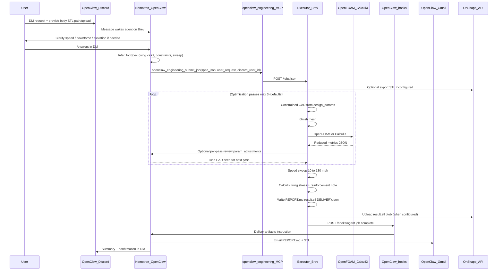

# OpenClaw Engineering — Complete Orchestration Flow

This document is the authoritative description of how the system is **supposed to work**. It matches the intended demo on NVIDIA Brev (64 CPU, 512 GB RAM): **OpenClaw** is the only user-facing platform; this repository is the **executor** OpenClaw calls via MCP.

**Product vision:** a **remote execution platform** on Brev that runs constrained CAD plus FEA/CFD for you end-to-end. You DM OpenClaw; Nemotron plans the job; this repo meshes, solves, iterates, and returns STL + a full spec sheet via Gmail/Discord.

---

## 1. Platforms and roles

| Piece | Role | You interact with it? |
|-------|------|------------------------|
| **OpenClaw** | Discord DM, Gmail, Nemotron (`nvidia/nemotron-3-super-120b-a12b`), skills, MCP, webhooks | **Yes** — this is the product |
| **openclaw-engineering** (this repo) | Runs CAD → mesh → OpenFOAM / CalculiX on the Brev host | No — only via the agent’s MCP tools |
| **OnShape** | Optional PLM: pull car STL in, push optimized STL back | Via API keys in `~/.openclaw-engineering/.env` |

There is **no** second Discord bot and **no** Gmail password stored in the executor — only **OpenClaw** channels.

---

## 2. End-to-end flow (happy path)



---

## 3. How you start a job (Discord private DM)

1. Deploy **OpenClaw on Brev** and complete `configure.sh` (NVIDIA Build API key → `~/.openclaw/.env`).
2. Enable **OpenClaw Discord** (`config/openclaw.discord.patch.json5`, `DISCORD_BOT_TOKEN`, DM pairing).
3. **DM the OpenClaw bot** (not a separate engineering bot).
4. Describe what you want in natural language. Ensure a **vehicle STL path/upload** is available to the executor when mount-aware constraints are needed.
5. The **agent infers** the demo type and may ask follow-ups before running anything.

### Example prompts

**Rear wing (914):**

> Design a low-drag, high-downforce rear wing for this 914. Target **200 lbs downforce at 40 mph**, sea level. Replace my STL and email the full spec from 10 mph to top speed. Stress-test the wing.

**Downforce kit:**

> Full downforce kit: front splitter, air dam, louvres on the front arches, underbody diffuser, and a venturi duct from the front that routes air over the windshield. Optimize for downforce; email full report and replace my STL.
> Full downforce kit: front splitter, air dam, louvres on the front arches, underbody diffuser, and a venturi duct from the front that routes air over the windshield. Optimize for downforce and deliver the report plus STL outputs.

**Structural (no new wing CAD):**

> Optimize this bracket for minimum mass with max stress under 200 MPa and 500 N tensile load.

---

## 4. What the OpenClaw agent must infer (every demo)

The agent reads [`skills/openclaw-engineering/SKILL.md`](../skills/openclaw-engineering/SKILL.md) and **you** do not pick modes from a fixed menu. For each request it decides:

| Decision | Options / notes |
|----------|-----------------|
| `discipline` | `fea` or `cfd` |
| `part_category` | Soft label: `wing`, `bracket`, `aero_kit`, `structural`, `custom` |
| `geometry_spec` | **Required** feature list (angles, joins, organic blends, holes, wing dims) |
| `deliverable_scope` | `addon_only` (part file only), `full_assembly`, `body_only` |
| `mode` | `optimize`, `analyze`, `generate`, `collab` |
| Objectives | e.g. minimize Cd, maximize downforce, minimize mass |
| Constraints | e.g. max stress MPa, target downforce at design speed |
| `fluid` | speed mph, target downforce lbs, elevation, density |
| `design_params` | Parametric bounds (AoA, chord, span for wings; kit scalars for kits) |
| `run_speed_sweep` | Typically `true` for vehicle aero demos |
| `run_wing_fea` | `true` for wings; `false` for full kit-only CFD |
| `flow_template` | e.g. `cfd_wing_optimize.yaml`, `optimize_fea.yaml` |
| `notify_email` | Where OpenClaw should send results |

If critical numbers are missing, the agent **asks in Discord** before calling MCP:

| Discipline | Ask when missing |
|------------|------------------|
| **CFD** | Design speed (mph), downforce/drag target, elevation |
| **FEA** | Force direction/magnitude (N), allowable stress (MPa) or material, how the part is fixed |

For FEA, Nemotron should **anticipate** reasonable loads from context (bracket under bolt tension, cantilever, etc.) when the user is vague — but must not invent numbers silently; either state assumptions in JobSpec or ask one clarifying question.

The executor **validates** JobSpec ([`openclaw_engineering/constraints.py`](../openclaw_engineering/constraints.py)) and can return `awaiting_user` with `needs_clarification` if FEA loads are absent.

---

## 5. Hardcoded flows vs what changes per job

| Fixed (YAML in [`flows/templates/`](../flows/templates/)) | Variable (agent JobSpec) |
|-----------------------------------------------------------|---------------------------|
| Step order per template (CAD/deform → solver → metrics) | OpenFOAM `fluid`, FEA `loads`, `constraints` |
| Tool bindings (Build123d, Gmsh, OpenFOAM, CalculiX) | `design_params` / `cad_params` for 3D accuracy to the real part |
| Max passes, parallel candidates, convergence | User `input.stl`, optional OnShape pull |

See [`flows/README.md`](../flows/README.md).

---

## 6. CAD ↔ simulation feedback loop (core iteration)

Each optimization pass:

1. **Generate** constrained CAD from `design_params` (NACA wing, downforce kit, or STL deform).
2. **Mesh + solve** — OpenFOAM (CFD) or CalculiX (FEA) using agent-set boundary conditions.
3. **Emit reduced metrics** — Cd/Cl/downforce or stress/mass only ([`openclaw_engineering/feedback.py`](../openclaw_engineering/feedback.py)).
4. **Nemotron review** (`agent_review_each_pass: true`) — returns `param_adjustments` to tune the CAD generator.
5. **Next pass** seeds from those adjustments (clamped to `design_params` min/max) in [`openclaw_engineering/optimizer.py`](../openclaw_engineering/optimizer.py).

The flow YAML does not change between iterations; only simulation inputs and CAD parameters move toward the user’s targets.
Per-pass LLM review occurs when gateway/token settings allow agent review calls.

---

## 7. Dynamic sculpt engine (Discord → MCP tools → `geometry_spec`)

Nemotron calls **`openclaw_engineering_list_sculpt_methods`** and fills `geometry_spec.sculpt_method` + `params`. The executor runs LEAP71/nTop-style loft and SDF kernels on Brev — see [`docs/SCULPT_ENGINE.md`](SCULPT_ENGINE.md).

Legacy `geometry_spec.features[]` still maps to sculpt methods. Proactive Q&A via `needs_clarification`.

Example methods: `wing_loft`, `hull_loft`, `nozzle_axisymmetric`, `sdf_compose`, `mesh_displacement`, `bracket_parametric`.

The agent collects **explicit** dimensions in Discord. Geometry is built from sculpt params, not fixed categories:

- **Brackets** — L/T, leg lengths, bend angle, thickness, join pattern (`gusseted`, `organic_blend`, `lap`, …)
- **Wings** — airfoil profile, span, chord, AoA (standalone file when `deliverable_scope: addon_only`)
- **Holes / organic transitions** — for machinability and tolerance control
- **Aero kits** — splitter/diffuser packages when requested

`REPORT.md` + `geometry_spec.json` document material, tolerance, and machining notes for build/order. Manufacturability checks reject bad units/extreme aspect ratios — not arbitrary shape bans.

### Uploaded STL

- User file is `input.stl` on the job when provided.
- Final **`result.stl`** follows `deliverable_scope` (`addon_only`, `full_assembly`, `body_only`).
- For `full_assembly`, `original_body.stl` may be included in artifacts for traceability.

---

## 8. Executor pipeline (what runs on Brev)

After MCP `openclaw_engineering_submit_job`, the executor runs **without** calling Nemotron on every mesh cell.

### Phase A — Planning (agent already done)

- Job stored under `~/.local/state/openclaw-engineering/jobs/<job_id>/`.
- Optional: OnShape export → `input_onshape.stl` or user upload → `input.stl`.

### Phase B — Optimization loop (credit-aware)

Default limits ([`config/openclaw-engineering.defaults.yaml`](../config/openclaw-engineering.defaults.yaml)):

- **Max 3 passes**
- Up to **8 parallel candidates** per pass (default)
- Stop when improvement **&lt; 2%** for 2 consecutive passes, or constraints met, or user cancel

Each pass runs flow template (e.g. [`flows/templates/cfd_wing_optimize.yaml`](../flows/templates/cfd_wing_optimize.yaml)):

1. **CAD** — `generate_geometry` (wing or kit)  
2. **Combine** — attach addon to body STL  
3. **Solve** — **OpenFOAM** (`simpleFoam`) for CFD  
4. **Metrics** — Cd, Cl, downforce N, drag N  

**OpenFOAM** is the physics solver; strict CFD runs fail if `simpleFoam` is not on PATH. Optional Optuna is **off** by default (`use_optuna: false`).

Between passes, **reduced JSON feedback** goes to Nemotron; `param_adjustments` feed the next CAD pass (see §6).

### Phase C — Post-processing (vehicle aero demos)

1. **Speed sweep** — CFD (or synthetic in dry-run) at **10, 20, … 130 mph** (stock 914-6 reference top speed ~130 mph).  
2. **Estimated top speed with aero** — drag increase vs stock baseline (wing slows the car; documented honestly).  
3. **Wing FEA** — CalculiX stress on wing; failure zones; optional **reinforcement** pass with notes in the report.

### Phase D — Artifacts

| File | Purpose |
|------|---------|
| `REPORT.md` | Full specification sheet (see §7) |
| `result.stl` | Final geometry per `deliverable_scope` |
| `part.stl` | Generated addon-only part (when present) |
| `metrics.json` | Last CFD point |
| `speed_sweep.json` | Table 10–130 mph |
| `wing_fea.json` | Stress / failure zones |
| `DELIVERY.json` | Instructions for OpenClaw agent to email/attach |
| `flow.snapshot.json` | Which YAML flow ran |

---

## 9. Specification sheet (`REPORT.md`) contents

The emailed document must include **all iteration history**, not only the final numbers:

1. Verbatim user request  
2. Geometry type and configuration  
3. Design parameters (final + per-pass table)  
4. **Optimization iteration log** — pass, feasible, objective, metrics, params, agent note  
5. **Aerodynamic speed sweep** — mph, Cd, Cl, downforce lbs, drag lbs  
6. **Top speed estimate** with aero vs stock  
7. **Wing structural analysis** — max stress, yield check, failure/reinforcement zones  
8. Downforce kit component list (if applicable)  
9. Deliverables list and engineering recommendation  

---

## 10. Delivery back to you

### Discord

OpenClaw agent confirms completion in the **same DM thread** with a short summary and key metrics.

### Gmail

Configured via OpenClaw on Brev:

```bash
openclaw webhooks gmail setup --account you@gmail.com
openclaw webhooks gmail run
```

The executor does **not** send mail directly. When the job finishes:

1. Writes `DELIVERY.json` with paths to artifacts.  
2. POSTs to OpenClaw **`/hooks/agent`** (`OPENCLAW_HOOK_TOKEN`, `config/openclaw.hooks.patch.json5`).  
3. Nemotron attaches `REPORT.md`, `result.stl`, and related files via **Gmail skill**.

### OnShape (optional)

If `ONSHAPE_*` keys and document/workspace/element IDs are set:

- **Pull** part studio STL before solve (if no upload).  
- **Push** `result.stl` back after completion (same filename when possible).

---

## 11. Configuration map

| Secret / setting | Where |
|------------------|--------|
| NVIDIA / OpenClaw gateway | `~/.openclaw/.env` (via `configure.sh` or OpenClaw terminal) |
| `DISCORD_BOT_TOKEN` | `~/.openclaw/.env` |
| Gmail OAuth | OpenClaw `openclaw webhooks gmail setup` |
| `OPENCLAW_HOOK_TOKEN` | `~/.openclaw/.env` and `~/.openclaw-engineering/.env` (API process env) |
| OnShape API keys + document IDs | `~/.openclaw-engineering/.env` |
| OpenFOAM, Gmsh, CalculiX, FreeCAD AppImage | Installed by [`setup.sh`](../setup.sh) on Brev |

---

## 12. MCP tools (agent → executor)

| Tool | Action |
|------|--------|
| `openclaw_engineering_submit_job(spec_json, user_request, discord_user_id)` | Start job; may return `awaiting_user` if clarification needed |
| `openclaw_engineering_job_status(job_id)` | Poll status, passes, artifacts |
| `openclaw_engineering_list_artifacts(job_id)` | List files |
| `openclaw_engineering_fetch_artifact(job_id, name)` | Download URL for REPORT / STL |

REST equivalent (same host): `http://127.0.0.1:8765` — see [`openclaw_engineering/api.py`](../openclaw_engineering/api.py).

---

## 13. Solver stack (ClawGeneer-aligned)

| Stage | Tool |
|-------|------|
| CAD (AI, constrained) | Build123d (CadQuery fallback) |
| CAD (GUI) | FreeCAD AppImage |
| Meshing | Gmsh |
| FEA | CalculiX (`ccx`) |
| CFD | **OpenFOAM** ESI / `simpleFoam` on PATH |
| Optimization scheduling | Pass loop on Brev CPUs (Optuna optional, default off) |
| AI planning & channels | **OpenClaw** + Nemotron |

---

## 14. Reference demo: Porsche 914 rear wing

Narrative you can use for judges or testing:

1. DM OpenClaw with 914 STL attached.  
2. Request: rear wing, 200 lbs @ 40 mph, sea level, low drag, full spec 10–130 mph, stress test.  
3. Agent clarifies anything missing, submits JobSpec with `discipline: cfd`, `part_category: wing`, and explicit `geometry_spec`.  
4. Executor runs ≤3 OpenFOAM optimization passes on wing geometry + body constraints (when body STL is provided).  
5. Speed sweep shows downforce/drag vs mph; report notes reduced top speed.  
6. CalculiX flags wing stress hot spots; reinforcement pass documented.  
7. Gmail: full `REPORT.md` + `result.stl`; OnShape updated; Discord confirmation.

Same skill and flow apply to **bracket FEA** or **downforce kit** — only the agent-inferred JobSpec changes.

---

## 15. Related documents

| Document | Contents |
|----------|----------|
| [SETUP.md](SETUP.md) | Install steps on Brev |
| [ARCHITECTURE.md](ARCHITECTURE.md) | Two-layer model summary |
| [STANDARDS.md](STANDARDS.md) | JobSpec and feedback JSON formats |
| [skills/openclaw-engineering/SKILL.md](../skills/openclaw-engineering/SKILL.md) | Agent contract (installed to `~/.openclaw/skills/`) |
| [config/openclaw-engineering-agent.md](../config/openclaw-engineering-agent.md) | Short agent system-prompt snippet |

---

## 16. Out of scope for this flow

- WhatsApp (Discord + OpenClaw only for hackathon)  
- Raw LLM mesh vertex output (geometry is executor-built from clarified `geometry_spec`)  
- SMTP credentials in the executor (Gmail via OpenClaw only)  
- Fully automatic topology optimization without clarified geometry constraints  
- Unlimited LLM-in-the-loop solver passes (bounded passes for cloud credits)
